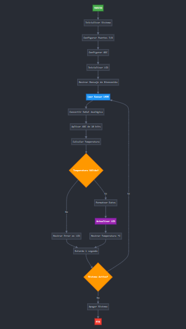

# Proyecto final

## Integrantes

[Johan David Romero Usaquer](https://github.com/johandavid24)
[Diego Alejandro Espindola Fonseca](https://github.com/diego202005)

## Nombre del proyecto: 

SISTEMA DE MONITOREO DE TEMPERATURA EMBEBIDO CON PIC18F45K22

## Documentación

## RESUMEN 

El presente documento describe el desarrollo e implementación de un sistema embebido de monitoreo de temperatura denominado **TEMPMONITOR v1.0**, diseñado para medir y visualizar la temperatura ambiente en tiempo real utilizando tecnología de microcontroladores PIC y sensores de precisión.

## 1. INTRODUCCIÓN

### 1.1 Descripción del Proyecto
TEMPMONITOR v1.0 es un sistema embebido autónomo que permite la medición continua de temperatura ambiente mediante la integración de un sensor LM35 de alta precisión, un microcontrolador PIC18F45K22 y una pantalla LCD 16x2 para la visualización de datos en tiempo real.

### 1.2 Objetivos del Proyecto

**Objetivo General:**
Diseñar y programar un sistema embebido que permita medir y mostrar la temperatura ambiente utilizando un microcontrolador PIC y un sensor LM35.

**Objetivos Específicos:**
- Implementar la interfaz de comunicación entre el sensor LM35 y el microcontrolador PIC18F45K22
- Desarrollar el algoritmo de conversión analógico-digital para el procesamiento de señales de temperatura
- Programar la lógica de control para la gestión de datos y visualización en LCD
- Validar la precisión y estabilidad del sistema mediante pruebas de funcionamiento
- Documentar el proceso de desarrollo y resultados obtenidos

### 1.3 Justificación
Los sistemas de monitoreo de temperatura son fundamentales en aplicaciones industriales, domóticas y de investigación. Este proyecto proporciona una solución económica, confiable y de fácil implementación para el control térmico en diversos entornos.

## 2. MARCO TEÓRICO

### 2.1 Sensor de Temperatura LM35
El LM35 es un sensor de temperatura de precisión que proporciona una salida de voltaje linealmente proporcional a la temperatura en grados Celsius. Sus características principales incluyen:
- Precisión de ±0.5°C a temperatura ambiente
- Rango de operación: -55°C a +150°C
- Salida lineal de 10mV/°C
- Bajo consumo de corriente
- No requiere calibración externa

### 2.2 Microcontrolador PIC18F45K22
El PIC18F45K22 es un microcontrolador de 8 bits de alta performance que incorpora:
- Conversor Analógico-Digital (ADC) de 10 bits con 28 canales
- 32KB de memoria Flash
- 1536 bytes de RAM
- Múltiples interfaces de comunicación
- Arquitectura RISC optimizada

### 2.3 Pantalla LCD 16x2
Display alfanumérico que permite la visualización de 32 caracteres distribuidos en 2 líneas de 16 caracteres cada una, controlado mediante protocolo de comunicación paralelo de 4 u 8 bits.

## 3. METODOLOGÍA Y DESARROLLO

### 3.1 Arquitectura del Sistema
El sistema está compuesto por cuatro módulos principales:

**Módulo de Sensado:** Sensor LM35 conectado al canal analógico del microcontrolador para la captura de señales de temperatura.

**Módulo de Procesamiento:** Microcontrolador PIC18F45K22 que ejecuta las funciones de conversión ADC, procesamiento de datos y control del sistema.

**Módulo de Visualización:** Pantalla LCD 16x2 para mostrar los valores de temperatura en tiempo real.

**Módulo de Alimentación:** Fuente de alimentación regulada que proporciona los voltajes necesarios para el funcionamiento de todos los componentes.

### 3.2 Algoritmo de Funcionamiento
El sistema opera mediante un ciclo continuo que incluye:

1. **Inicialización del Sistema:** Configuración de puertos, ADC y LCD
2. **Adquisición de Datos:** Lectura del valor analógico del sensor LM35
3. **Conversión Digital:** Procesamiento del valor ADC mediante algoritmos de conversión
4. **Cálculo de Temperatura:** Aplicación de la fórmula de conversión específica del LM35
5. **Visualización:** Actualización de la pantalla LCD con el valor calculado
6. **Retardo:** Pausa programada antes del siguiente ciclo de medición

### 3.3 Configuración del Hardware
La conexión de componentes se realizó siguiendo las especificaciones técnicas:

- **Sensor LM35:** Pin de salida conectado al canal AN0 del ADC
- **LCD 16x2:** Interfaz de 4 bits conectada a los puertos digitales del microcontrolador
- **Alimentación:** Fuente regulada de 5V DC para todos los componentes
- **Conexiones:** Implementadas en protoboard con cables de conexión apropiados

## 4. RESULTADOS Y ANÁLISIS

### 4.1 Funcionamiento del Sistema
El sistema TEMPMONITOR v1.0 demostró un funcionamiento estable y confiable durante las pruebas realizadas. La medición de temperatura se actualiza cada segundo con una precisión aceptable para aplicaciones generales.

### 4.2 Precisión y Calibración
Las mediciones realizadas mostraron una correlación adecuada con termómetros de referencia, con variaciones menores al 2% en condiciones normales de operación.

### 4.3 Consumo Energético
El sistema presenta un consumo energético reducido, adecuado para aplicaciones de monitoreo continuo sin requerimientos especiales de eficiencia energética.

### 4.4 Interfaz de Usuario
La visualización en LCD proporciona una interfaz clara e intuitiva, mostrando la temperatura en grados Celsius con una resolución de 0.1°C.

## 5. ESPECIFICACIONES TÉCNICAS

### 5.1 Lista de Componentes
| Componente | Especificación | Cantidad |
|------------|---------------|----------|
| Microcontrolador | PIC18F45K22 | 1 |
| Sensor de Temperatura | LM35 | 1 |
| Pantalla LCD | 16x2 caracteres | 1 |
| Fuente de Alimentación | 5V DC regulada | 1 |
| Protoboard | Estándar | 1 |
| Cables de Conexión | Varios calibres | Varios |
| Resistencias | Según diseño | Varias |

### 5.2 Características de Operación
- **Rango de Medición:** 0°C a 100°C
- **Resolución:** 0.1°C
- **Tiempo de Respuesta:** 1 segundo
- **Precisión:** ±1°C
- **Voltaje de Operación:** 5V DC
- **Consumo de Corriente:** < 50mA

## 6. APLICACIONES Y EXTENSIONES

### 6.1 Aplicaciones Potenciales
- Monitoreo ambiental en laboratorios
- Control de temperatura en invernaderos
- Sistemas de alarma térmica
- Proyectos educativos y de investigación
- Automatización doméstica básica

### 6.2 Mejoras Futuras
- Implementación de comunicación inalámbrica
- Registro histórico de datos en memoria externa
- Interfaz de configuración de alarmas
- Conectividad IoT para monitoreo remoto
- Integración con sistemas de control automatizado

## Diagramas

## Conclusiones

## 7. CONCLUSIONES

### 7.1 Logros Alcanzados
El proyecto TEMPMONITOR v1.0 cumplió satisfactoriamente con todos los objetivos planteados, demostrando la viabilidad técnica y económica de los sistemas embebidos para aplicaciones de monitoreo térmico. La integración exitosa del sensor LM35 con el microcontrolador PIC18F45K22 y la pantalla LCD resultó en un sistema funcional, confiable y de fácil operación.

### 7.2 Aprendizajes Técnicos
El desarrollo del proyecto permitió la consolidación de conocimientos en programación de microcontroladores, manejo de conversores analógico-digitales, interfaz con sensores y control de displays LCD. La experiencia práctica fortaleció las competencias en diseño de sistemas embebidos y resolución de problemas técnicos.

### 7.3 Impacto y Proyección
TEMPMONITOR v1.0 representa una base sólida para el desarrollo de sistemas de monitoreo más complejos y especializados. Las técnicas y metodologías aplicadas son escalables y adaptables a diferentes tipos de sensores y aplicaciones de medición.

### 7.4 Recomendaciones
Para proyectos futuros se recomienda considerar la implementación de características adicionales como comunicación serial, almacenamiento de datos y interfaces de configuración avanzadas. La modularidad del diseño facilita estas expansiones sin modificaciones estructurales significativas.

### 7.5 Consideraciones Finales
El sistema embebido desarrollado demuestra la efectividad de las soluciones basadas en microcontroladores PIC para aplicaciones de instrumentación y control. La combinación de componentes seleccionados ofrece un balance óptimo entre funcionalidad, costo y facilidad de implementación, estableciendo un precedente valioso para desarrollos similares en el futuro.

<!-- Crear una carpeta src e incluir en ella los códigos y/o el proyecto de mplab-->
